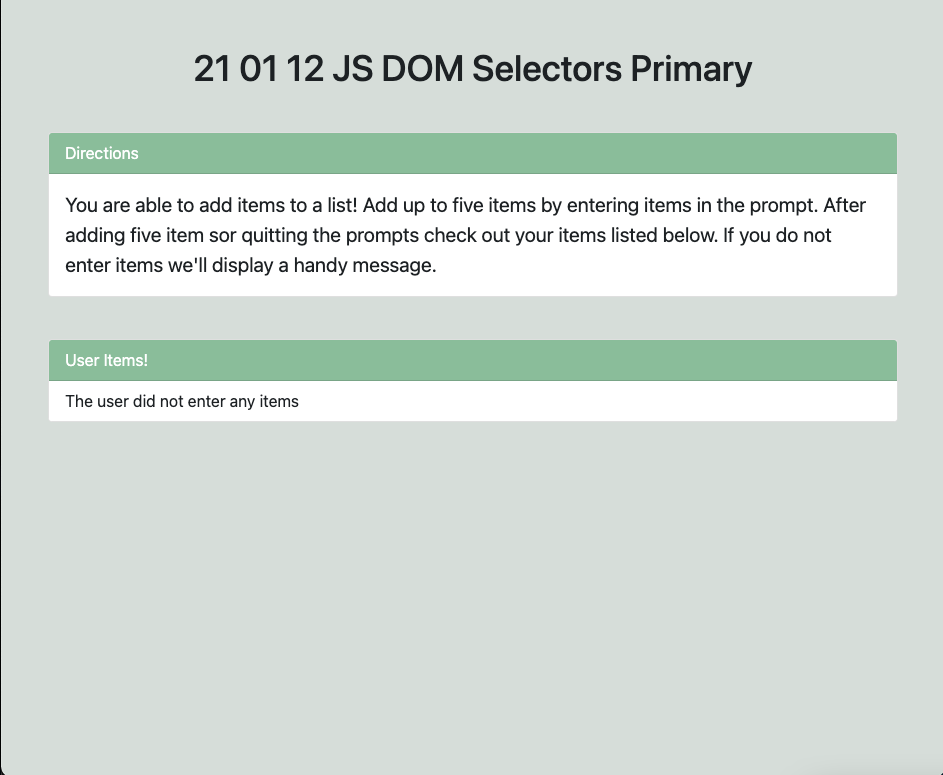
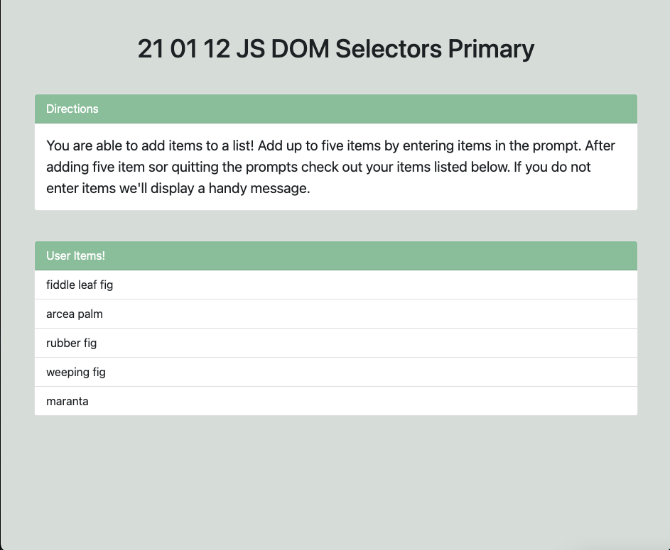
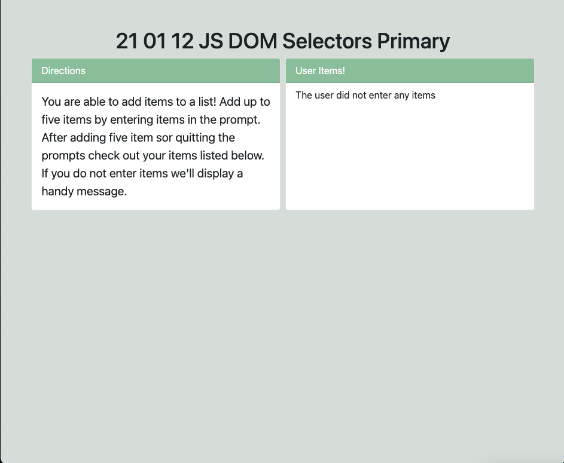
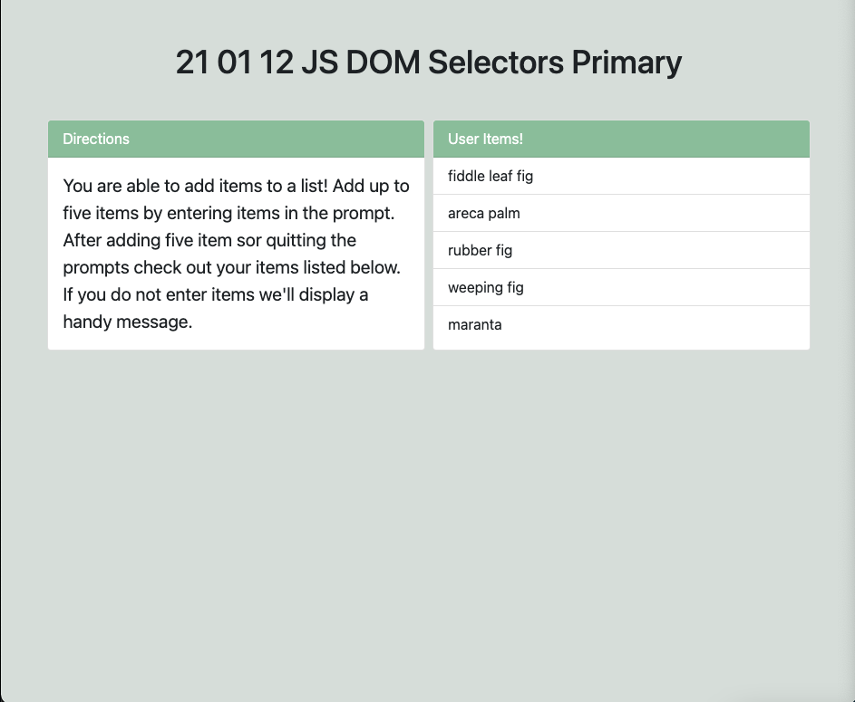

# 21 01 12 JS DOM Selectors Primary

Add comments throughout the JavaScript file (at minimum). Comment out any broken code before 9PM submission and provide context on what's not working. You will need bootstrap to complete this assignment. You can grab the CDN from [here](https://getbootstrap.com/docs/5.0/getting-started/introduction/#css) and access the component documentation [here](https://getbootstrap.com/docs/5.0/components/card/). Create HTML, JS, and CSS files. Link the bootstrap stylesheet then your stylesheet in the head using the link tag. Link the JS file at hte bottom of the body tag using the script tag. Ensure that the files are linked and push before starting on any requirements. 

Requirements

HTML + CSS
1. Chose a background color for your page and pull all content away from the window similarly to the wireframes using margin.
1. Display the assignment title as a centered heading at the top of the page.
1. Display a bootstrap card with a heading and a description of what your site does similarly to the wireframes.
1. Display another card with a heading that will display user items as list items using the [list group card](https://getbootstrap.com/docs/5.0/components/card/#list-groups). 

JS
1. When the page loads the user should be prompted to add items to an array until five items have been entered or you enter "q".
    - Declare an empty array
    - Prompt the user to enter an item
    - As long as the item is not "q" *and* the array has fewer than 5 items add the item and prompt again
    - Check that this requirement has been met by iterating through the array using a forEach after the while loop to log each item to the console 
1. Once the user is no longer being prompted display each item entered in the second card. If the user didn't enter any items display the message "The user did not enter any items".
    - Select the second card using query selector passing in the existing bootstrap class for the selector
    - If the array has at least one item, iterate through the array using a foreach to update the innerHTML of the selected element to *append* a new list item to the exiting innerHTML with the correct bootstrap class that displays each item in the array
    - If the array has 0 items, update the innerHTML of the selected element to a list item with the correct bootstrap class and the message specific above
    - Check that this requirement has been met by adding 1-5 items via prompt then adding 0 items

Wireframes

Bonus : Display the directions and items cards side by side instead of one on top of the other.

Wireframes

